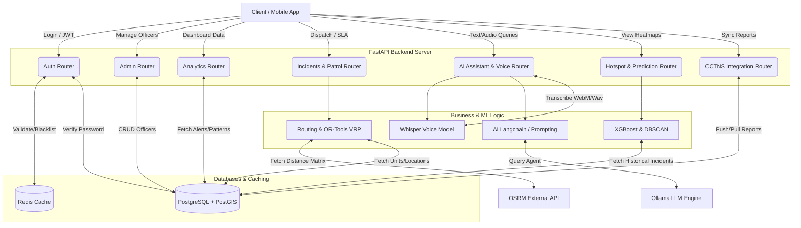

# SAMRAKSHA Backend Architecture & Flow

This document provides a comprehensive, graphical, and detailed explanation of the SAMRAKSHA backend ecosystem. The backend is designed for high-performance, real-time spatial awareness, and AI-driven predictive policing.

## 1. High-Level Architecture Flowchart

Below is a Mermaid flowchart demonstrating how the various backend components interact.

---

## 2. Component Explanations & Workflows

### A. Authentication & Security (Redis Token Blacklisting)
**Workflow**: 
1. When an officer logs in, `bcrypt` hashes and verifies the password against PostgreSQL. 
2. A JWT token is generated containing the officer's `id` and role.
3. **Production Logout**: When the officer logs out, the JWT's unique identifier (`jti`) is sent to **Redis** with a Time-To-Live (TTL) matching the token's expiration.
4. Every subsequent request checks the Redis blacklist. If the token is found, access is instantly rejected (401 Unauthorized), preventing token theft.

### B. Map & Navigation (OSRM + OR-Tools VRP)
**Workflow**:
1. When a high-priority incident occurs, the system must dispatch multiple patrol units.
2. The `RoutingService` collects the geolocation (Lat/Lon) of available units and active hotspots from PostGIS.
3. It sends an asynchronous HTTP request to the **OSRM (Open Source Routing Machine)** API to get a real-world driving distance matrix.
4. **Fallback mechanism**: If OSRM is offline, it dynamically falls back to a mathematical **Haversine formula** to approximate distances based on earth curvature.
5. The matrix is fed into **Google OR-Tools** (Vehicle Routing Problem solver), which mathematically calculates the shortest, most efficient assignment of units to hotspots.

### C. Predictive AI Models (XGBoost & Clustering)
**Workflow**:
1. When the dashboard requests the Hotspot Surge widget, the `PredictionService` activates.
2. It queries PostgreSQL for historical incident data (hour of day, day of week, month, and severity).
3. The data is processed using **Pandas**, mapping text severities to numerical risk scores.
4. An **XGBoost Regressor** model is trained on this data asynchronously.
5. The trained model predicts crime risk scores for various city wards based on current time inputs, adjusting for festival events via the `FESTIVAL_CALENDAR` integration.
6. For spatial heatmaps, the system applies **KDE (Kernel Density Estimation)** and **DBSCAN (Density-Based Spatial Clustering of Applications with Noise)** to group nearby crimes into actionable red zones on the map.

### D. AI Assistant & Voice Operations
**Workflow**:
1. **Voice Input**: An officer clicks the microphone, records a query, and sends the raw audio blob to the backend.
2. The `VoiceService` loads an offline **OpenAI Whisper** model into memory. It converts the raw speech into text.
3. **Text Processing**: The text is forwarded to the `LLMService`.
4. The service attempts to connect to the **Ollama** engine to interpret the intent (e.g., "Find all chain snatching cases today").
5. **Robust Fallback**: If Ollama crashes or is unreachable, the API gracefully intercepts the `httpx.ConnectError` and returns a systemic algorithmic response (searching the DB based on keywords rather than AI intent), ensuring the officer is never left with a frozen UI.

### E. Analytics & CCTV Anomaly Matching
**Workflow**:
1. CCTV cameras flag anomalies (e.g., suspicious vehicles, large crowds).
2. The data is inserted into the `cctv_alerts` table in PostgreSQL.
3. The `AnalyticsAPI` queries this table, linking alerts to active FIRs (First Information Reports) to generate **AI Pattern Matches**.
4. The API returns real-time JSON payloads to populate the dashboard's "AI Pattern Matches" and "Resource Allocation" widgets.

### F. External Integrations (CCTNS)
**Workflow**:
1. The backend exposes the `/cctns` router which is fully mounted into the `main.py` application.
2. This router is responsible for standardizing data schemas to match national databases for pushing and pulling registered cases.
